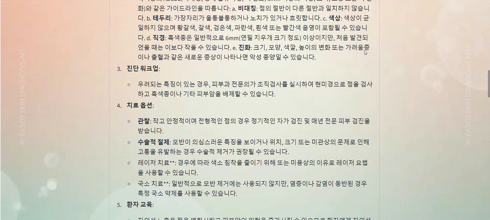
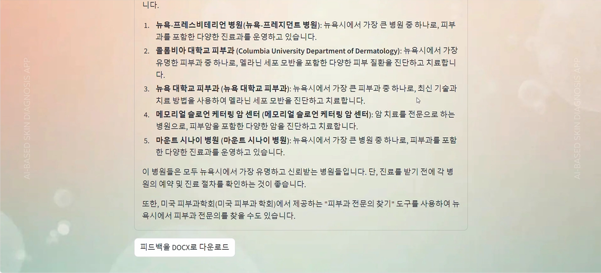

# Know Your Skin - AI-based Skin Disease Diagnosis 

This is an AI-based skin disease diagnosis website using Azure's Custom Vision, PhiModel, and LlamaModel. The app allows users to upload an image of their skin and get a prediction of a skin condition along with treatment recommendations.

## Features
- Skin condition prediction using a custom vision model.
- Multilingual support (English, Korean, Chinese, Japanese, Spanish).
- Feedback generation and treatment recommendations.
- Option to download feedback as a .docx file.

## Demo Screenshot

Below is a <b>main</b> screen of the application:

<table>
  <tr>
    <td></td>
    <td></td>
  </tr>
</table>

Below is a <b>LLM</b> screen of the application:

<table>
  <tr>
    <td></td>
    <td></td>
  </tr>
</table>

Below is a <b>download</b> screen of the application:

<table>
  <tr>
    <td></td>
  </tr>
</table>


## Requirements
- Python 3.x
- Streamlit
- Pillow
- deepl
- requests
- python-docx
- azure-ai-inference

## Installation

1. Clone the repository:
   ```bash
   git clone https://github.com/yourusername/know-your-skin.git
2. Navigate to the project folder:
   ```bash
   cd know-your-skin
3. Create and activate a virtual environment (optional but recommended):
   ```bash
   python -m venv venv
   source venv/bin/activate  # On Windows use: venv\Scripts\activate
4. Install the dependencies:
   ```bash
   pip install -r requirements.txt
5. Run the app:
   ```bash
   streamlit run app.py

## Configuration

To run the app locally, you need to configure the following environment variables. It is recommended to use a `.env` file in the root of your project.

1. Create a `.env` file in the root directory of the project.

2. Add the following variables to your `.env` file:

   ```ini
   PREDICTION_KEY=your_custom_vision_prediction_key
   ENDPOINT=your_custom_vision_endpoint
   PROJECT_ID=your_project_id
   ITERATION_NAME=your_iteration_name

   MODEL_CATALOG_ENDPOINT=your_phi_model_endpoint
   MODEL_CATALOG_API_KEY=your_phi_model_api_key

   LLAMA_TOKEN=your_llama_token
   LLAMA_ENDPOINT=your_llama_endpoint
   LLAMA_MODEL_NAME=your_llama_model_name

   DEEPL_API_KEY=your_deepl_api_key

## License
This project is licensed under the MIT License - see the [LICENSE](LICENSE) file for details.
